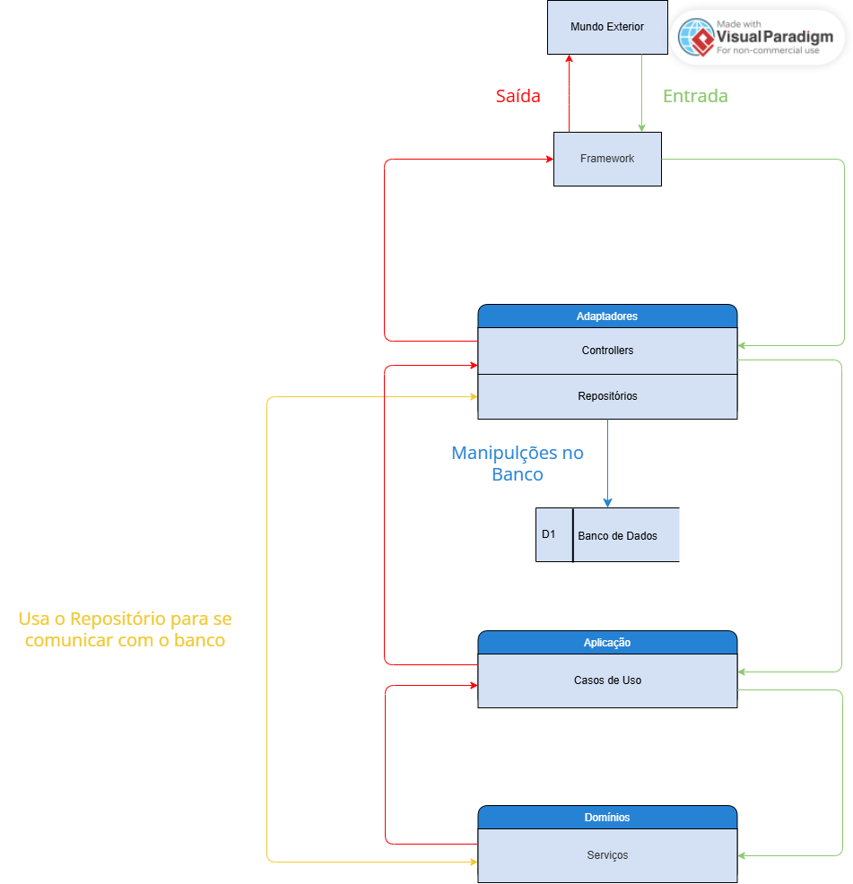

# Relatório de Arquitetura e Implementação - Fase 1
**Aluno:** Felipe Alves
**Projeto:** Serviço de Gestão Backend

---

## 1. Diagrama de Estrutura (UML e Módulos)

A arquitetura segue um fluxo de dependências de fora para dentro, garantindo que o núcleo (Domínio) seja agnóstico a frameworks e infraestrutura.

Segue abaixo um diagrama do fluxo de dados:

A comunicação entre a camada de domínio e os repositórios para a manipulação dos dados ocorre via interfaces, garantindo que o domínio seja agnóstico às implementações. 

O mesmo ocorre para qualquer comunicação entre camadas mais internas e externas, sempre via interfaces (ex: Aplicação -> Adaptadores). 

### Organização de Módulos

- **src/dominios** - Responsável por definir as regras de negócio. É a parte que mais se conecta com a lógica do mundo do negócio. Utiliza-se de modelos para representar "coisas" do mundo real e serviços para lidar com essas regras (ex: serviço de cliente, serviço de cadastro, etc.). Serviço apenas manipula modelos.

- **src/aplicacao** - Casos de Uso (Orquestração). Casos de uso também lidam com regras de negócio, porém, somente quando elas estiverem intimamente ligadas a mais de um domínio. Ex: Um caso de uso de agendamento de consulta pode utilizar internamente o domínio de pacientes, o domínio de unidades de atendimento, o domínio de especialidades, o domínio de profissionais, etc. Como a tarefa/ação "agendar" envolve muitas coisas ao mesmo tempo, o caso de uso serve como uma ferramenta para "orquestrar" os serviços de domínio. Um serviço tende a ser mais especializado que um caso de uso.

- **src/adaptadores** - Também chamada de "infra" ou "infraestrutura", é a camada "suja" da arquitetura. Implementações de Repositórios, Banco de Dados e Frameworks. Ter uma camada específica para isso nos permite, por exemplo, mudar de banco de dados (ex: TypeORM para Prisma ou MongoDB para MySQL) sem alterar as outras camadas (aplicação e domínio).

- **src/adaptadores/web** - Responsável por criar a ponte de conexão via HTTP. Aqui você verá controllers, middlewares, rotas, etc.

- **src/adaptadores/persistencia** - Responsável por criar a ponte de conexão com o banco de dados. Aqui você verá entidades, repositórios, etc. Entidades, de forma semelhante aos modelos, abstraem as tabelas ou coleções do banco de dados. Por exemplo: se temos uma tabela de pacientes, uma entidade de paciente. Nem sempre há uma equivalência entre entidades de persistência de dados e modelos de domínio. Para coisas mais básicas geralmente há uma relação de 1 para 1, mas, conforme a complexidade aumenta, pode haver uma relação de 1 para muitos ou muitos para muitos. Os repositórios, por outro lado, são classes que manipulam as entidades que estão no banco de dados. Fazem o mapeamento entre entidades e tabelas/coleções, mas não implementam regras de negócio - somente fazem o CRUD (Create, Read, Update, Delete).

- **src/comuns** - Classes e utilitários comuns, que podem ser usadas em qualquer camada. Por exemplo, tipagens, interfaces, funções úteis, etc.

> **Observação:** Para este projeto de estudo em específico, foi feito um caso de uso para cada rota, que ficaram responsáveis apenas por chamar os serviços de domínio. Chamamos isso de "caso de uso passa-prato", pois ele é tão simples que ele apenas "repassa" para os serviços de domínio, não tendo lógica própria. Em projetos reais, costuma-se evitar o uso de casos de uso passa-prato.

---

## 2. Conformidade com os Princípios SOLID
A organização das classes foi fundamentada nos seguintes pilares:

* **SRP (Single Responsibility Principle):** Cada caso de uso (ex: `AtualizarAssinatura.casoUso`) possui uma única razão para mudar.
* **OCP (Open/Closed Principle):** O sistema é extensível para novos bancos de dados via interfaces, sem alterar as regras de negócio.
* **LSP (Liskov Substitution Principle):** Repositórios mockados para testes herdam as mesmas interfaces que os repositórios reais (TypeORM).
* **ISP (Interface Segregation Principle):** Interfaces de domínio são granulares, evitando que o Caso de Uso dependa de métodos que não utiliza.
* **DIP (Dependency Inversion Principle):** A camada de aplicação depende de interfaces, não de implementações concretas (Inversão de Controle).

---

## 3. Padrões de Projeto e Clean Architecture
Além da estrutura de camadas, foram aplicados:
* **Repository Pattern:** Desacoplamento da lógica de persistência, a conexão e manipulação com o banco de dados ficam apenas em um único lugar - no repositório.
* **Dependency Injection:** Utilização de containers ou fábricas para instanciar dependências do Nest.js, como também interfaces e classes base (ex: IRepositorioBase e o RepositorioBase, IServicoBase e o ServicoBase, etc.) para diminuir a complexidade de construção de objetos e também permitir a comunicação entre camadas.
* **DTO (Data Transfer Objects):** Para transição de dados entre camadas sem expor entidades.

---

## 4. Conclusão e Relato de Desenvolvimento
### Desafios Encontrados:
- **Gestão de Validação de Dados via DTO:** Neste projeto, a validação de dados foi feita via DTO, o que tornou o processo de desenvolvimento mais seguro, porém, ligeiramente complexo. Existem formas melhores de implementar, como usando Zod, Yup, etc., mas o objetivo principal do projeto era demonstrar a arquitetura limpa e, portanto, o uso de DTOs.
- **Criação de Classes Bases:** O uso de classes base (ex: `RepositorioBase` e `ServicoBase`) ajudou a diminuir a complexidade de construção de objetos e permitiu a comunicação entre camadas. Como tudo, o investimento inicial é mais demorado, mas, com o tempo, o benefícios se tornam notáveis.
- **Criação de um Script Genérico para Setup de Ambiente de Desenvolvimento:** Foram criados dois arquivos `setup.cloud.cmd` e `setup.local.cmd` para facilitar o setup de ambiente local e na nuvem, respectivamente. Houve diversos problemas de permissão do Windows e encoding em que o terminal executa o SQL (SET NAMES no início do SQL resolveu o problema).

---